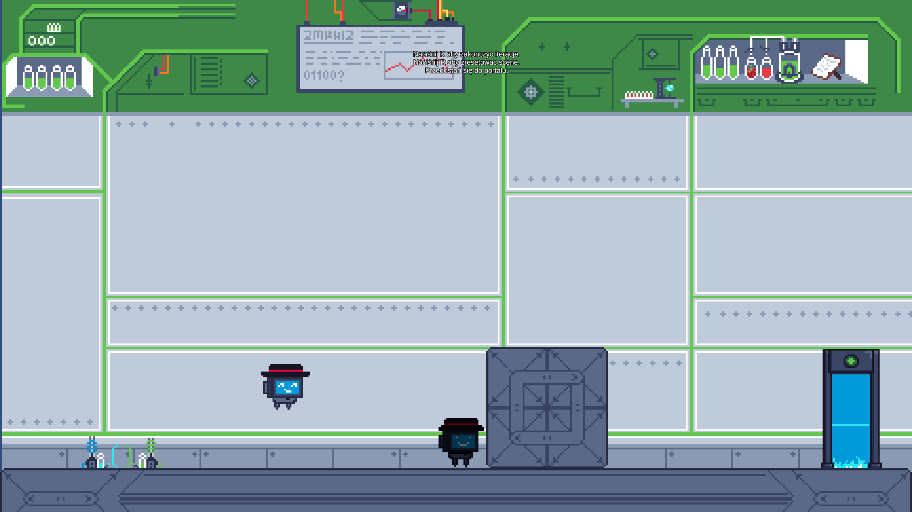
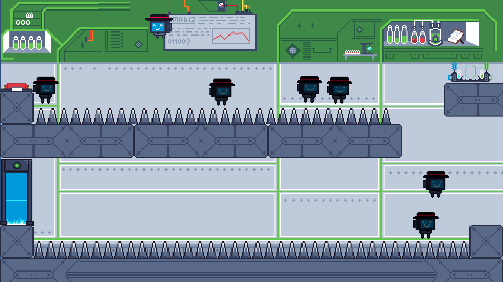
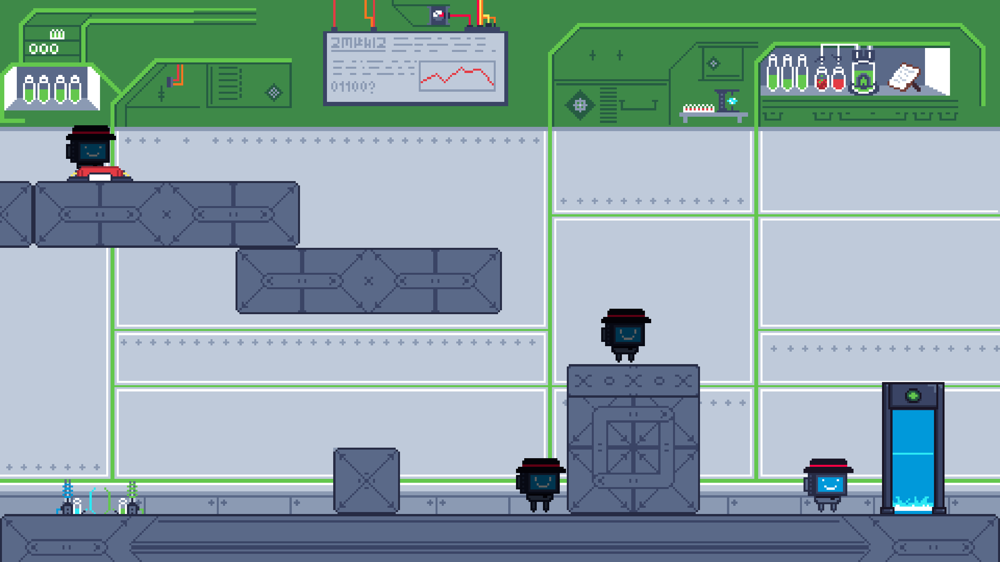

# The Recursive Robot

[**Pobierz grę (Windows & Linux)**](https://polslpl-my.sharepoint.com/:f:/g/personal/kb305480_student_polsl_pl/EvZODStVKHlPg3LFsuC8b9MBnT6zq7oXTsfkqK2Wftz8WA?e=u3ze2s)

## O grze
**The Recursive Robot** to platformówka stworzona w 24 godziny podczas Bitfestival Hackathon 2024. Gra powstała w odpowiedzi na temat *"Break the Loop"* i opowiada historię robota uwięzionego w pętli. W grze gracze muszą wykorzystać duchy swoich poprzednich działań, aby pokonać przeszkody i ukończyć poziomy.

### Kluczowe cechy:
- **Mechanika duchów:** Po śmierci Twoje poprzednie ruchy są odgrywane przez ducha, którego możesz wykorzystać do przechodzenia poziomów.
- **Interaktywna rozgrywka:** Mądrze kontroluj momenty wyłączania robota, aby planować kolejne ruchy.
- **Tematyka pętli:** Rozwiązuj zagadki, przełamując cykl i odkrywając tajemnice pętli.

## Technologie
- **Silnik gry:** Unity
- **Platformy:** Windows, Linux
- **Czas pracy:** 24 godziny

## Twórcy
Gra została stworzona przez czteroosobowy zespół:
- **Tomasz Korecki**
- **Kacper Baryłowicz**    
- **Jakub Kozieński**  
- **Jakub Haberek**  

## Instalacja
1. Pobierz [gotowy build](https://polslpl-my.sharepoint.com/:f:/g/personal/kb305480_student_polsl_pl/EvZODStVKHlPg3LFsuC8b9MBnT6zq7oXTsfkqK2Wftz8WA?e=u3ze2s) dla swojego systemu operacyjnego.
2. Wypakuj archiwum.
3. Uruchom plik wykonywalny:
   - Windows: `TheRecursiveRobot.exe`
   - Linux: Uruchom plik wykonywalny przez terminal (upewnij się, że plik ma odpowiednie uprawnienia).

## Zrzuty ekranu

## Licencja
Projekt został stworzony na potrzeby Bitfestival Hackathon 2024 i jest dostępny jako open-source wyłącznie w celach edukacyjnych i niekomercyjnych.
